# Software Requirements Specification (SRS)
## Secure Password Manager — Browser Extension
### Version 0.1.0 | Phase-1 (Demo Mode)

---

> [!NOTE]
> This document follows the **IEEE 830-1998** standard for Software Requirements Specifications. All UML diagrams are rendered using Mermaid notation.

---

## Table of Contents

1. [Introduction](#1-introduction)
2. [Overall Description](#2-overall-description)
3. [System Architecture](#3-system-architecture)
4. [UML Diagrams](#4-uml-diagrams)
5. [Functional Requirements](#5-functional-requirements)
6. [Non-Functional Requirements](#6-non-functional-requirements)
7. [External Interface Requirements](#7-external-interface-requirements)
8. [Data Dictionary](#8-data-dictionary)
9. [Security Requirements](#9-security-requirements)
10. [Appendix](#10-appendix)

---

## 1. Introduction

### 1.1 Purpose
This SRS defines the software requirements for the **Secure Password Manager**, a zero-plaintext Firefox browser extension that captures, encrypts, stores, and auto-fills user credentials. The system employs multi-layer encryption (AES-256-GCM, PBKDF2, SHA-256) to ensure that no credential is ever stored or transmitted in plaintext.

### 1.2 Scope

| Attribute | Detail |
|---|---|
| **Product Name** | Secure Password Manager |
| **Type** | Firefox WebExtension (Manifest V2) |
| **Version** | 0.1.0 |
| **Phase** | Phase-1 (Internal Demo) |
| **Target Browser** | Firefox 78.0+ |
| **Backend** | Node.js HTTP Server + MongoDB |
| **Deployment** | Local development (localhost:8080) |

The system consists of four major subsystems:
1. **Browser Extension** (popup UI, background service, content scripts)
2. **Cryptographic Engine** (client-side AES-GCM / PBKDF2 / SHA-256)
3. **Backend API Server** (Node.js REST API — the "CPU")
4. **SSO Web Portal** (supplementary login portal)

### 1.3 Definitions, Acronyms, and Abbreviations

| Term | Definition |
|---|---|
| **CPU** | Central Processing Unit — the project's name for the backend server |
| **Vault** | Encrypted credential storage (local + cloud) |
| **Master Password** | The single password that derives all encryption keys |
| **AES-GCM** | Advanced Encryption Standard in Galois/Counter Mode |
| **PBKDF2** | Password-Based Key Derivation Function 2 |
| **Blind Index** | SHA-256 hash of email used for lookup without revealing the email |
| **SSO** | Single Sign-On |
| **Metadata Encryption** | AES-GCM encryption using a static internal key for usernames, emails, timestamps |
| **Dynamic Key** | A per-credential AES key derived from master password + username + hour + counter via PBKDF2 |

### 1.4 References
- IEEE Std 830-1998 — Recommended Practice for Software Requirements Specifications
- Web Crypto API Specification (W3C)
- WebExtensions API Documentation (MDN)
- MongoDB Driver Documentation (v6.x)

---

## 2. Overall Description

### 2.1 Product Perspective
The Secure Password Manager operates as a Firefox browser extension with a companion Node.js backend. It intercepts login form submissions on visited websites, captures credentials, encrypts them client-side, and stores encrypted packets in MongoDB via the backend API. All cryptographic operations occur in the browser's Web Crypto API — the server **never** sees plaintext passwords.

### 2.2 Product Functions (Summary)

| # | Function | Description |
|---|---|---|
| F1 | **User Registration** | Register with username, email, master password, and safety Q&A |
| F2 | **Email Verification** | Verify email via a tokenized link |
| F3 | **User Login / Vault Unlock** | Authenticate and load master password into session memory |
| F4 | **Credential Capture** | Intercept form submissions and capture username/password pairs |
| F5 | **Credential Save** | Encrypt and store captured credentials to the vault |
| F6 | **Vault Browse** | List and decrypt saved credentials on demand |
| F7 | **Auto-Fill** | Automatically fill login forms on matching sites |
| F8 | **Account Recovery** | Recover account via safety question/answer |
| F9 | **Password Reset** | Reset master password after recovery verification |
| F10 | **SSO Code Issuance** | Issue single-sign-on codes via the web portal |
| F11 | **Session Management** | JWT-like token sessions with expiry |
| F12 | **Cloud Sync** | Optional hashed cloud backup of vault entries |

### 2.3 User Characteristics

| User Class | Description |
|---|---|
| **End User** | Individual managing personal web credentials; requires no technical knowledge |
| **Administrator** | Developer/operator managing the backend server and MongoDB instance |

### 2.4 Constraints
- Firefox 78.0+ only (Manifest V2, `browser.*` API namespace)
- Backend must run on `localhost:8080` during Phase-1
- Demo mode uses in-memory mock collections (no persistent MongoDB in Phase-1)
- Master password is held in RAM only during an active session
- SMTP configuration required for email verification in production

### 2.5 Assumptions and Dependencies
- User has Firefox browser installed
- Node.js runtime (v25.5+) is available for the backend
- MongoDB Atlas or local instance is available for production deployment
- HTTPS will be enforced in production (currently HTTP for development)

---

## 3. System Architecture

### 3.1 High-Level Architecture

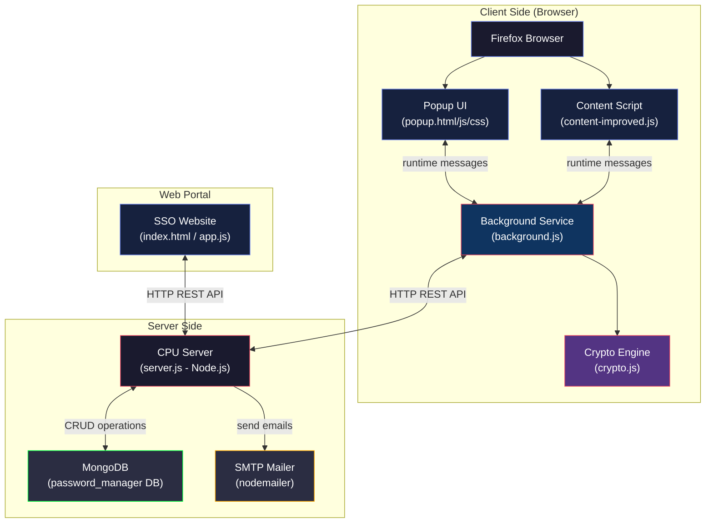

### 3.2 Technology Stack

| Layer | Technology |
|---|---|
| Frontend (Extension) | HTML5, CSS3, Vanilla JavaScript |
| Frontend (Web Portal) | HTML5, CSS3, Vanilla JavaScript |
| Background Processing | Firefox WebExtension API (Manifest V2) |
| Cryptography | Web Crypto API (AES-GCM, PBKDF2, SHA-256) |
| Backend Server | Node.js (native `http` module) |
| Database | MongoDB (via `mongodb` npm driver v6.x) |
| Email | Nodemailer (SMTP transport) |
| Configuration | dotenv |

---

## 4. UML Diagrams

### 4.1 Use Case Diagram

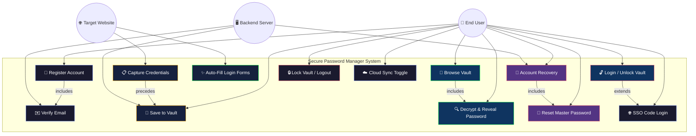

---

### 4.2 Class Diagram

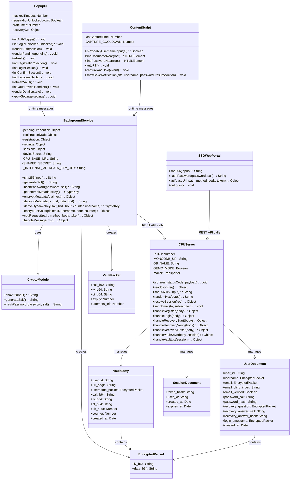

---

### 4.3 Sequence Diagram — User Registration

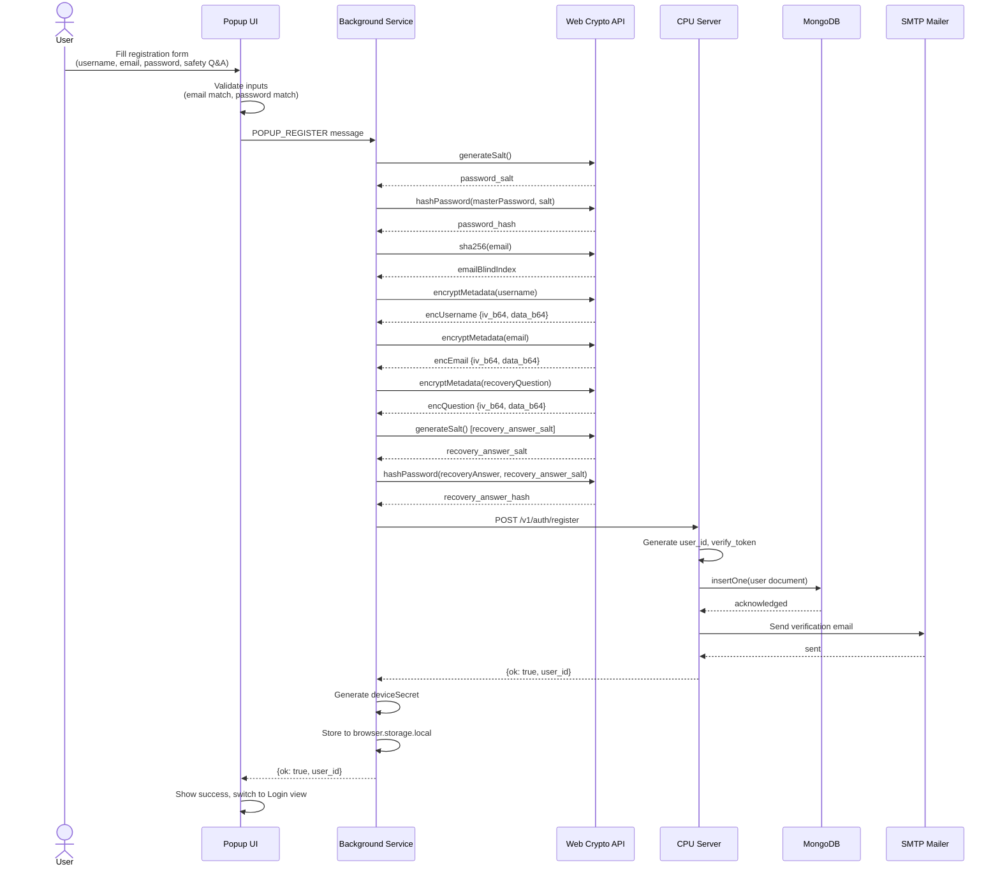

---

### 4.4 Sequence Diagram — Login & Vault Unlock

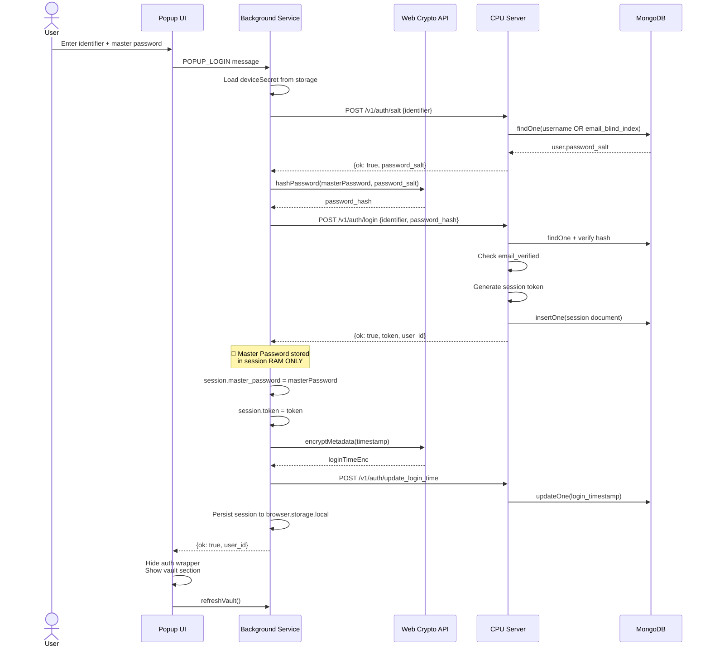

---

### 4.5 Sequence Diagram — Credential Capture & Save

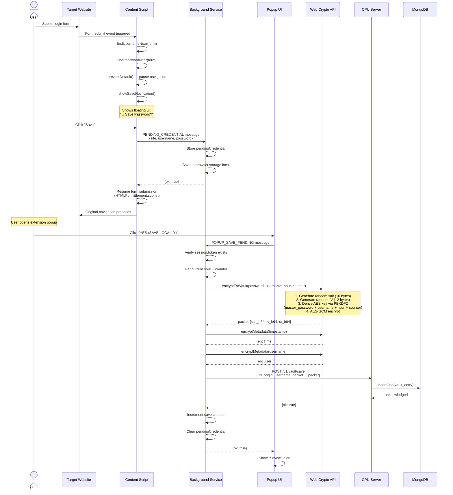

---

### 4.6 Sequence Diagram — Account Recovery

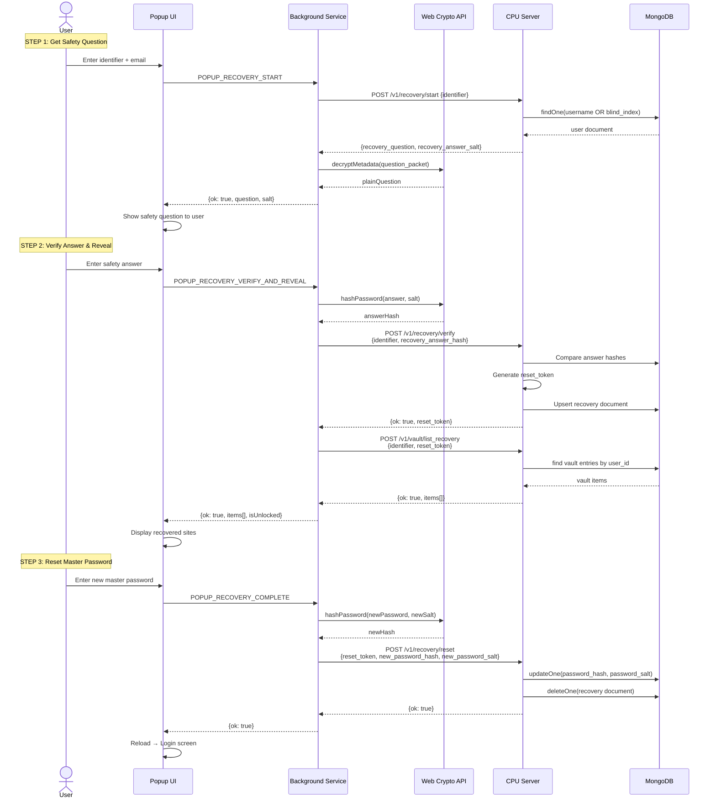

---

### 4.7 Component Diagram

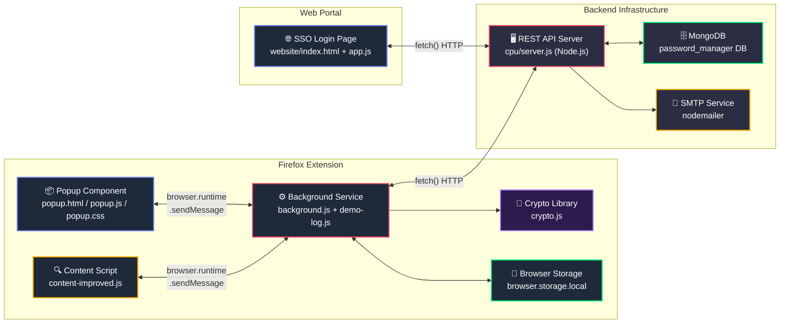

---

### 4.8 Activity Diagram — Credential Capture & Save Flow

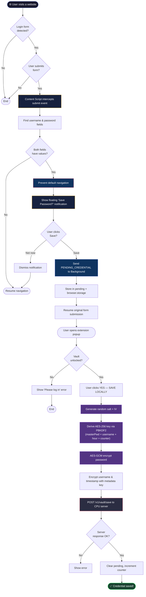

---

### 4.9 Deployment Diagram

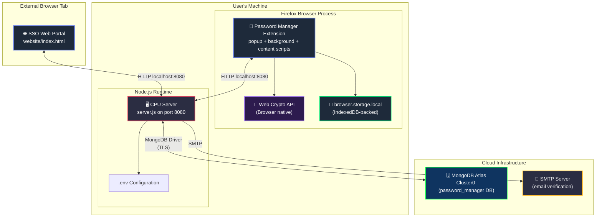

---

### 4.10 State Machine Diagram — Vault Session Lifecycle

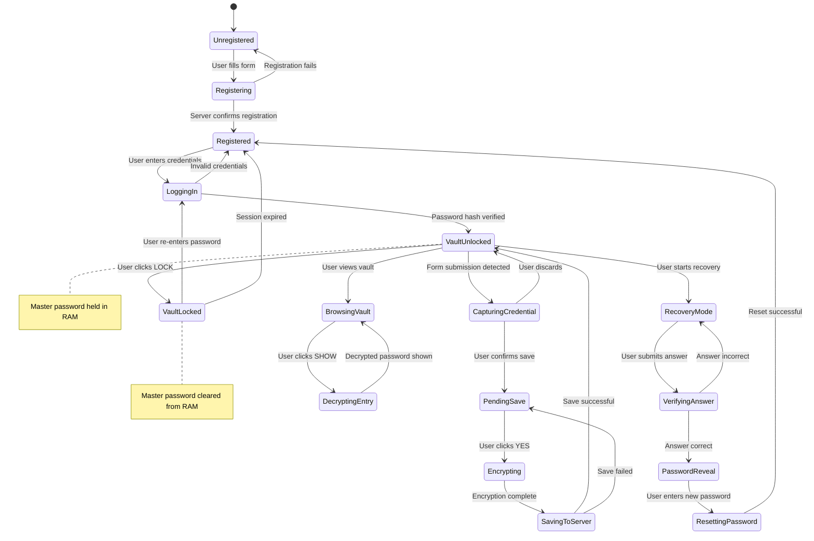

---

### 4.11 Entity-Relationship Diagram (Database)

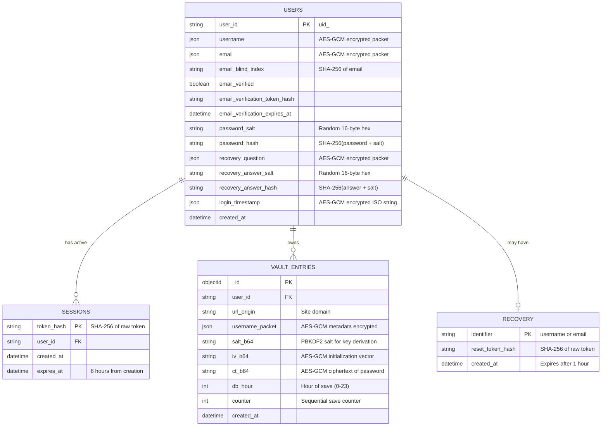

---

## 5. Functional Requirements

### 5.1 User Registration (FR-01)

| Attribute | Detail |
|---|---|
| **ID** | FR-01 |
| **Priority** | HIGH |
| **Input** | Username, Email (×2), Master Password (×2), Safety Question, Safety Answer |
| **Validation** | Email fields must match; Password fields must match |
| **Process** | 1. Generate password salt → SHA-256 hash password<br/>2. Compute email blind index (SHA-256 of lowercase email)<br/>3. AES-GCM encrypt username, email, question with internal key<br/>4. Generate recovery_answer_salt → hash answer<br/>5. POST all to `/v1/auth/register`<br/>6. Server generates user_id, sends verification email<br/>7. Generate deviceSecret → store locally |
| **Output** | Success status with user_id |
| **Error Cases** | EMAIL_MISMATCH, PASSWORD_MISMATCH, Server error |

### 5.2 Email Verification (FR-02)

| Attribute | Detail |
|---|---|
| **ID** | FR-02 |
| **Priority** | MEDIUM |
| **Input** | Verification token (URL query parameter) |
| **Process** | 1. User clicks link in email<br/>2. Server hashes token → finds user<br/>3. Sets `email_verified = true` |
| **Output** | "Verified!" HTML page |
| **Constraint** | Token expires after 24 hours |

### 5.3 Login / Vault Unlock (FR-03)

| Attribute | Detail |
|---|---|
| **ID** | FR-03 |
| **Priority** | HIGH |
| **Input** | Identifier (username or email), Master Password |
| **Process** | 1. Fetch password_salt from server via `/v1/auth/salt`<br/>2. Hash password client-side<br/>3. POST to `/v1/auth/login`<br/>4. Server verifies hash + email_verified status<br/>5. Server creates session (6h expiry)<br/>6. Background stores master_password in RAM |
| **Output** | Session token, user_id |
| **Security** | Master password ONLY exists in background process memory |

### 5.4 Credential Capture (FR-04)

| Attribute | Detail |
|---|---|
| **ID** | FR-04 |
| **Priority** | HIGH |
| **Input** | Form submission event on any website |
| **Process** | 1. Content script intercepts submit/click event<br/>2. Heuristic detection of username and password fields<br/>3. Show floating notification UI<br/>4. On confirm: send PENDING_CREDENTIAL to background |
| **Output** | Credential stored as pending in background + browser.storage |
| **Constraint** | 5-second cooldown between captures |

### 5.5 Credential Save to Vault (FR-05)

| Attribute | Detail |
|---|---|
| **ID** | FR-05 |
| **Priority** | HIGH |
| **Input** | Pending credential (site, username, password) |
| **Process** | 1. Verify session is active<br/>2. Generate random salt (16 bytes) and IV (12 bytes)<br/>3. Derive AES-256 key: PBKDF2(masterPassword + username + hour + counter, salt, 200000 iterations, SHA-256)<br/>4. AES-GCM encrypt password<br/>5. Metadata-encrypt username and timestamp<br/>6. POST to `/v1/vault/save`<br/>7. Increment save counter |
| **Output** | Encrypted vault entry stored in MongoDB |

### 5.6 Vault Browse & Decrypt (FR-06)

| Attribute | Detail |
|---|---|
| **ID** | FR-06 |
| **Priority** | HIGH |
| **Input** | User request to view vault |
| **Process** | 1. Fetch vault list from server<br/>2. Display sites and encrypted usernames<br/>3. On "SHOW PASSWORD": re-derive dynamic key → AES-GCM decrypt |
| **Output** | Decrypted password shown in UI |

### 5.7 Auto-Fill (FR-07)

| Attribute | Detail |
|---|---|
| **ID** | FR-07 |
| **Priority** | MEDIUM |
| **Input** | Page load on any website |
| **Process** | 1. Check if user is logged in<br/>2. Fetch vault list<br/>3. Match current `location.origin` to stored entries<br/>4. Decrypt matching entry<br/>5. Fill username and password fields |
| **Output** | Login form populated with saved credentials |

### 5.8 Account Recovery (FR-08)

| Attribute | Detail |
|---|---|
| **ID** | FR-08 |
| **Priority** | HIGH |
| **Input** | Identifier, email, safety answer |
| **Process** | 3-step flow:<br/>1. **Start**: Fetch + decrypt safety question<br/>2. **Verify**: Hash answer → server comparison → get reset_token<br/>3. **Reveal**: List vault entries using reset_token |
| **Output** | Revealed account list, ability to reset password |

### 5.9 Password Reset (FR-09)

| Attribute | Detail |
|---|---|
| **ID** | FR-09 |
| **Priority** | HIGH |
| **Input** | New master password (×2), recovery context |
| **Process** | 1. Re-verify safety answer<br/>2. Generate new salt + hash<br/>3. POST to `/v1/recovery/reset` with reset_token |
| **Output** | Password updated, user redirected to login |
| **Constraint** | New password minimum 8 characters |

### 5.10 SSO Code Login (FR-10)

| Attribute | Detail |
|---|---|
| **ID** | FR-10 |
| **Priority** | LOW |
| **Input** | 8-character SSO code from web portal |
| **Process** | 1. Web portal authenticates → issues SSO code<br/>2. User enters code in extension<br/>3. Extension validates code against server |
| **Output** | Vault unlocked via SSO |

### 5.11 Session & Lock Management (FR-11)

| Attribute | Detail |
|---|---|
| **ID** | FR-11 |
| **Priority** | HIGH |
| **Input** | Lock button click or session timeout |
| **Process** | 1. Clear master_password from RAM<br/>2. Invalidate session token<br/>3. Update UI to locked state |
| **Output** | Vault locked, re-authentication required |

---

## 6. Non-Functional Requirements

### 6.1 Security (NFR-01)

| Requirement | Detail |
|---|---|
| **NFR-01.1** | All passwords must be encrypted using AES-256-GCM before transmission |
| **NFR-01.2** | Key derivation must use PBKDF2 with minimum 200,000 iterations |
| **NFR-01.3** | Master password must NEVER be stored persistently (RAM-only during session) |
| **NFR-01.4** | Email addresses stored as blind indices (SHA-256 hashes) for lookup |
| **NFR-01.5** | All metadata (username, email, timestamps) encrypted with AES-GCM |
| **NFR-01.6** | Session tokens must be hashed (SHA-256) before storage |
| **NFR-01.7** | Recovery tokens must expire within 1 hour |
| **NFR-01.8** | CORS headers must be restrictive in production |

### 6.2 Performance (NFR-02)

| Requirement | Detail |
|---|---|
| **NFR-02.1** | Credential capture must not add more than 200ms latency to form submission |
| **NFR-02.2** | Vault decryption must complete within 500ms per entry |
| **NFR-02.3** | Server API response time must be under 300ms for all endpoints |

### 6.3 Usability (NFR-03)

| Requirement | Detail |
|---|---|
| **NFR-03.1** | Popup UI width must be 420px for consistent display |
| **NFR-03.2** | Password must be masked by default with explicit reveal |
| **NFR-03.3** | Save notification must auto-hide after 5 seconds |
| **NFR-03.4** | Clear visual indicators for locked/unlocked states |

### 6.4 Reliability (NFR-04)

| Requirement | Detail |
|---|---|
| **NFR-04.1** | Pending credentials must persist across popup close/reopen |
| **NFR-04.2** | Application must gracefully handle server unavailability |
| **NFR-04.3** | Demo mode must provide full functionality without MongoDB connection |

### 6.5 Compatibility (NFR-05)

| Requirement | Detail |
|---|---|
| **NFR-05.1** | Extension must be compatible with Firefox 78.0+ |
| **NFR-05.2** | Backend must run on Node.js v25.5+ |
| **NFR-05.3** | MongoDB driver compatibility v6.x |

---

## 7. External Interface Requirements

### 7.1 User Interfaces

| Interface | Description |
|---|---|
| **Popup Extension** | 420px-wide dark-themed panel with sections for credential capture, auth, vault, and recovery |
| **Save Notification** | Floating gradient notification (300px wide) injected into websites |
| **SSO Web Portal** | Standalone HTML page for SSO code generation |

### 7.2 Software Interfaces

| Interface | Protocol | Description |
|---|---|---|
| Browser ↔ Background | `browser.runtime.sendMessage` | Async message passing (JSON payloads) |
| Background ↔ Server | HTTP REST | JSON over HTTP (localhost:8080) |
| Server ↔ MongoDB | MongoDB Wire Protocol | Via `mongodb` npm driver |
| Server ↔ SMTP | SMTP/TLS | Via `nodemailer` |

### 7.3 API Endpoints

| Method | Endpoint | Auth | Description |
|---|---|---|---|
| POST | `/v1/auth/register` | None | Create new user account |
| GET | `/v1/email/verify` | Token (query) | Verify email address |
| POST | `/v1/auth/salt` | None | Fetch user's password salt |
| POST | `/v1/auth/login` | None | Authenticate and get session token |
| POST | `/v1/auth/update_login_time` | Bearer token | Update encrypted login timestamp |
| POST | `/v1/vault/save` | Bearer token | Save encrypted credential |
| POST | `/v1/vault/list_recovery` | Reset token | List vault entries for recovery |
| POST | `/v1/recovery/start` | None | Get encrypted safety question |
| POST | `/v1/recovery/verify` | None | Verify safety answer |
| POST | `/v1/recovery/reset` | Reset token | Update master password |
| GET | `/health` | None | Server health check |

---

## 8. Data Dictionary

### 8.1 Message Types (Extension Internal)

| Message Type | Direction | Purpose |
|---|---|---|
| `POPUP_GET_STATE` | Popup → BG | Get current app state |
| `PENDING_CREDENTIAL` | Content → BG | Stage captured credentials |
| `POPUP_DISCARD_PENDING` | Popup → BG | Discard pending credentials |
| `POPUP_REGISTER` | Popup → BG | Register new account |
| `POPUP_LOGIN` | Popup → BG | Authenticate user |
| `POPUP_LOGOUT` | Popup → BG | Lock vault |
| `POPUP_SAVE_PENDING` | Popup → BG | Encrypt and save credentials |
| `POPUP_GET_VAULT_LIST` | Popup → BG | Fetch vault entries |
| `POPUP_DECRYPT_VAULT_ENTRY` | Popup → BG | Decrypt a specific entry |
| `POPUP_DECRYPT_VAULT_ITEM` | Popup → BG | Decrypt vault item password |
| `POPUP_DECRYPT_RECOVERY_ITEM` | Popup → BG | Decrypt metadata during recovery |
| `POPUP_RECOVERY_START` | Popup → BG | Begin recovery process |
| `POPUP_RECOVERY_VERIFY_AND_REVEAL` | Popup → BG | Verify answer and reveal vault |
| `POPUP_RECOVERY_COMPLETE` | Popup → BG | Reset master password |

### 8.2 Encryption Schemes

| Scheme | Algorithm | Key Source | Used For |
|---|---|---|---|
| **Metadata Encryption** | AES-256-GCM | Static internal key (SHA-256 of hex string) | Username, email, timestamps, safety question |
| **Vault Encryption** | AES-256-GCM | PBKDF2-derived dynamic key | Stored passwords |
| **Password Hashing** | SHA-256 | N/A | Master password, recovery answer |
| **Blind Indexing** | SHA-256 | N/A | Email lookup without exposing plaintext |

---

## 9. Security Requirements

### 9.1 Threat Model

| Threat | Mitigation |
|---|---|
| Server database breach | Passwords encrypted client-side; server never sees plaintext |
| Network eavesdropping | HTTPS enforcement (production); encrypted payloads regardless |
| Brute-force master password | SHA-256 hashing with random salt; PBKDF2 200K iterations |
| Session hijacking | Token SHA-256 hashed before storage; 6-hour expiry |
| Email enumeration | Blind index lookup prevents direct email comparison |
| Cross-site scripting (XSS) | Extension content security policy; isolated context |
| RAM dump attack | Master password held temporarily; cleared on lock |

### 9.2 Encryption Architecture

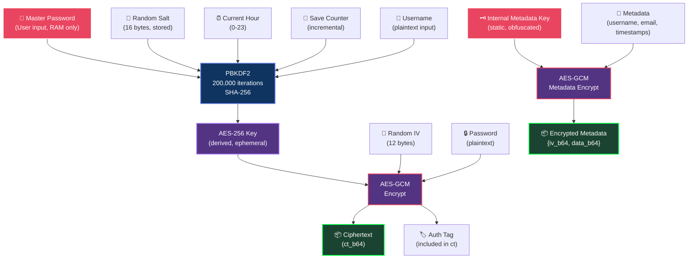

---

## 10. Appendix

### 10.1 File Structure

```
password_manager_2nd_draft-master/
├── manifest.json              # Extension manifest (Manifest V2)
├── package.json               # Root project dependencies
├── .gitignore
│
├── background/
│   ├── background.js          # Core logic: crypto, auth, vault, messaging
│   └── demo-log.js            # Demo mode logging utilities
│
├── content/
│   └── content-improved.js    # Credential capture & auto-fill
│
├── crypto/
│   └── crypto.js              # Shared hash/salt utilities
│
├── popup/
│   ├── popup.html             # Extension popup UI
│   ├── popup.js               # Popup interaction logic
│   └── popup.css              # Dark theme styling
│
├── cpu/
│   ├── server.js              # Node.js REST API backend
│   ├── package.json           # Server dependencies
│   ├── .env                   # Environment configuration
│   └── .env.example           # Configuration template
│
├── website/
│   ├── index.html             # SSO web portal
│   ├── app.js                 # SSO client logic
│   └── style.css              # Portal styling
│
└── icons/
    └── icon-64.png            # Extension icon
```

### 10.2 Environment Variables

| Variable | Required | Default | Description |
|---|---|---|---|
| `MONGODB_URI` | Yes | — | MongoDB connection string |
| `DB_NAME` | No | `password_manager` | Database name |
| `PORT` | No | `8080` | Server port |
| `PUBLIC_BASE_URL` | No | `http://localhost:8080` | Public-facing URL for email links |
| `SMTP_HOST` | No | — | SMTP server hostname |
| `SMTP_PORT` | No | `587` | SMTP port |
| `SMTP_SECURE` | No | `false` | Use TLS for SMTP |
| `SMTP_USER` | No | — | SMTP username |
| `SMTP_PASS` | No | — | SMTP password |
| `EMAIL_FROM` | No | — | Sender email address |

### 10.3 Browser Permissions

| Permission | Justification |
|---|---|
| `storage` | Persist session, pending credentials, device secret |
| `unlimitedStorage` | Allow large vault storage |
| `activeTab` | Access current tab for content script injection |
| `webRequest` | Monitor network requests for credential detection |
| `*://localhost/*` | Communicate with local CPU server |
| `http://*/*` | Content script injection on all HTTP sites |
| `https://*/*` | Content script injection on all HTTPS sites |

---

> [!IMPORTANT]
> **Phase-1 Limitations**: The current version runs in Demo Mode with in-memory mock database collections. All MongoDB operations succeed but do not persist data. Phase-2 will enable real MongoDB persistence, email verification enforcement, and production HTTPS deployment.

---

*Document generated on: 2026-04-04*
*Project: Secure Password Manager v0.1.0*
*Standard: IEEE 830-1998*
